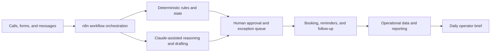

# Russell York

**Founder, [Nyxora AI](https://nyxora-ai.com/) | Aspiring AI Engineer | Preparing for WGU's B.S. in AI Engineering**

I design practical, human-supervised AI automation systems around real business workflows. My current focus is strengthening my software, data, cloud, and machine-learning foundations while continuing to build and operate Nyxora AI.

## Featured project: Nyxora AI

[Nyxora AI](https://nyxora-ai.com/) is a self-directed automation project for independent med spas and aesthetics clinics. It is designed to help clinics respond to leads faster, follow up consistently, reduce no-shows, request reviews, rebook clients, and reactivate inactive clients—with a real person kept in control.

### What I contributed

- Identified the business problem and mapped the customer lifecycle from missed call or new inquiry through booking, reminders, aftercare, reviews, rebooking, and win-back
- Designed the system architecture, component boundaries, workflow states, approval queues, exception handling, and operator handoffs
- Selected and operated a self-hosted automation stack using n8n, Docker, a reverse proxy, DNS/CDN services, operational data stores, and uptime monitoring
- Integrated Claude into selected steps for qualification, drafting, summaries, demos, and operator assistance while retaining deterministic rules and human approval where appropriate
- Built the product offer, website, demos, discovery process, reporting concepts, and a permission-based outreach approach
- Directed AI-assisted implementation, tested outputs, corrected direction, and took responsibility for product and architecture decisions

### Sanitized system architecture

### Workflow capabilities

- Missed-call response and speed-to-lead follow-up
- Inquiry qualification and consultation booking
- Appointment reminders and no-show reduction
- Aftercare and review requests
- Rebooking, retention, and client reactivation
- Approval queues, reporting, and daily operator briefs

## Technical experience

**Hands-on exposure:** n8n, Claude, Notion, Docker, Caddy, Cloudflare, VPS hosting, Cal.com, Zoho Mail, workflow data tables, DNS, reverse proxying, and uptime monitoring.

**Actively developing:** Python, Git/GitHub, APIs, SQL, testing, Linux, cloud services, data structures and algorithms, mathematics for machine learning, model evaluation, observability, and production software engineering.

## Professional background

- **Walgreens — Shift Lead (2024–present):** Supervise daily operations, coordinate staffing and priorities, uphold policy and safety standards, resolve customer and employee concerns, mentor new team members, and maintain operational documentation.
- **AT&T Wireless — Corporate Trainer (2024):** Delivered training for employees and managers across multiple locations, created presentations and procedural documentation, maintained performance tracking, evaluated training effectiveness, and partnered with leadership on improvement opportunities.
- **Framebridge — Trainer (2021–2023):** Led onboarding and coaching, maintained training resources and records, evaluated employee progress, and supported productivity and quality goals.

These roles strengthened my ability to translate complex systems into usable processes, coach people through change, document repeatable operations, and manage real-world exceptions—skills I apply directly to human-in-the-loop AI systems.

## Current direction

- Prepare to begin Western Governors University's [B.S. in AI Engineering](https://www.wgu.edu/online-it-degrees/ai-engineering.html)
- Build stronger Python and API-backed applications that I can explain end to end
- Add logging, testing, evaluation, security, and reliability practices to Nyxora
- Develop a focused portfolio of documented AI, data, and software-engineering projects

## Professional strengths

My background in operations, training, customer-facing leadership, and cross-team coordination gives me a systems mindset: I focus on reliability, handoffs, exceptions, user impact, and measurable outcomes—not just the demo.

## Honest scope

I am an early-career AI engineering candidate, not yet a professional software or ML engineer. I use AI tools as collaborators for research, explanation, code generation, and iteration. I define the problem, make product and architecture decisions, test the work, correct direction, and remain accountable for the system.

---

**Explore Nyxora AI:** [nyxora-ai.com](https://nyxora-ai.com/)
